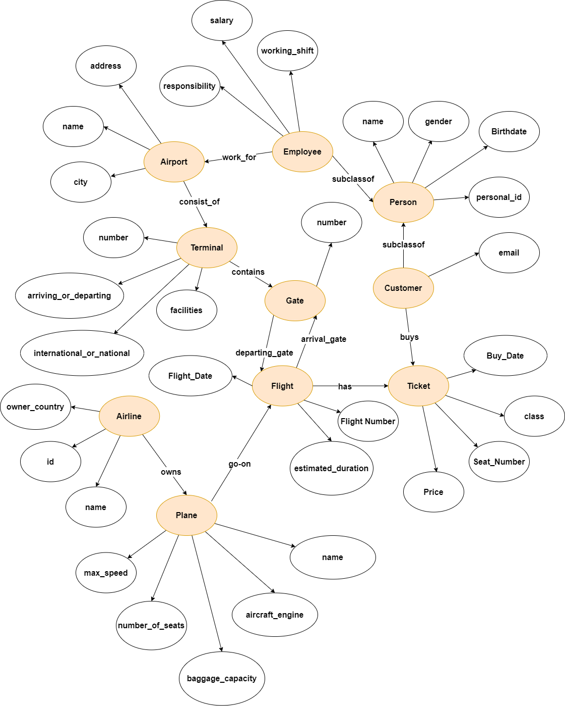
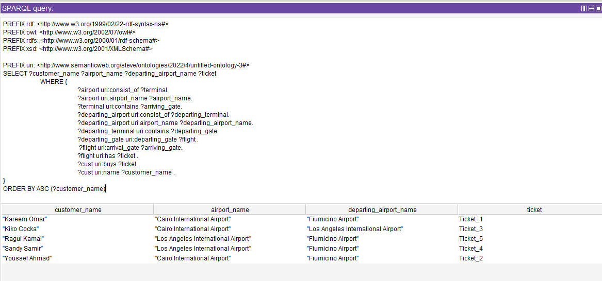
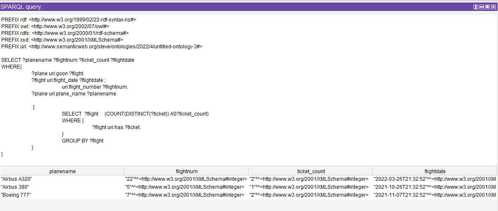
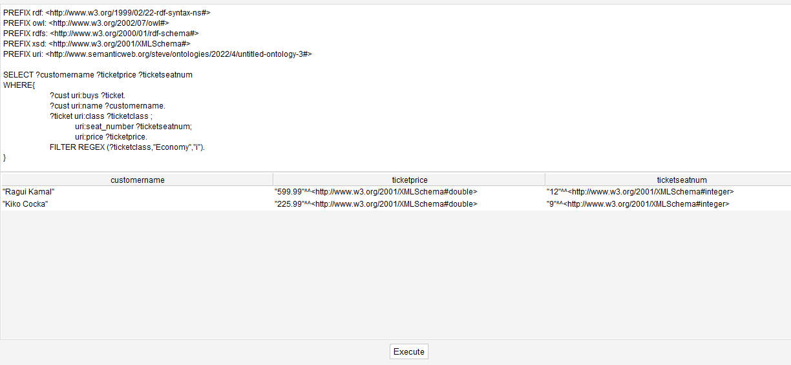

[link_dona]: <https://github.com/dona-samir>
[link_steven]: <https://github.com/steeevvv>

# AIRPORT ONTOLOGY DESIGN
### _CSE488 Ontologies and the Semantic Web Project_

## Introduction
This is a case study for an Airport Ontology design. Where Customers buy tickets, Employees work for airports, Airlines has planes, and much more relations. Throughout this readme we will declare the design of our Ontology: Entities, Object Properties, Data Properties, and Constraints.

It was implemented on Protégé, A free, open-source ontology editor and framework for building intelligent systems.

## RDF Graph

## Declaring Entity Constraints
* Airline
  * An Airline hosts at least 1 Flight
  * An Airline owns Minimum 1 Plane and Maximum 100 Planes
* Airport 
  * An Airport consists of Maximum 5 Terminals
  * An Airport can have Maximum 300 Employee working in 
* Flight 
  * A Flight has exactly 1 Arrival Gate
  * A Flight has exactly 1 Departing Gate
  * A Flight can have a Maximum of 240 Tickets
  * A Flight is went by exactly 1 plane
  * A Flight is owned by exactly 1 Airline 
* Gate 
  * A Gate has minimum 5 arriving flights
  * A Gate has Minimum 5 departing flights
* Customer (Subclass of Person)
  * A Customer buys at least a ticker
* Employee (Subclass of Person)
  * An Employee works for exactly 1 Airport
* Plane
  * A Plane is owned by exactly 1 Airline
  * A Plane goes on multiple flights
* Terminal
  * A Terminal exists in exactly 1 airport
  * A Terminal contains maximum 52 Gates
* Ticket
  * A Ticket is being bought by exactly 1 Customer
  * A Ticket has exatly 1 Flight     

## Data Property Constraints
* aircraft_engine (Plane) is either:
  * Turbofan
  * Turbojet
  * Turboprop
  * Turboshaft
* arriving_or_departing (Terminal) is either:
  * Arriving
  * Departing
* baggage_capacity (Plane) has some value between: 0 --> 10000 kg
* class (Ticket) is either:
  * Economy
  * First class
  * Business
* estimated_duration (Flight) has some value between: 0 --> 1130 minutes
* facilities (Terminal) has:
  * Dutyfree
  * Foodcourt
  * Shopping
  * WC
* gate_number (Gate) has some value between: 0 --> 52
* gender (Person) is either:
  * Male
  * Female
* international_or_national (Terminal) is either:
  * International
  * National
* max_speed (Plane) has some value 0 --> 1046.07 kmph
* number_of_seats (Plane) has some value between 0 --> 1087 
* price (Ticket) is minimum 0
* responsibility (Employee) is either:
  * cleaner
  * crew
  * fueler
  * mechanic engineer
  * pilot
  * reservation
  * security
* salary (Employee) has some value between 0 --> 30000 USD
* terminal_number (Terminal) has some value between 0 --> 10
* working_shift (Employee) is either:
  * am
  * pm

## Sample Sparql Queries

1. Returns Customer Names, departing and arriving airports of each ticket booked by every customer

2. Returns Ticket count booked for each Flight, and shows respective plane name, flight number and flight date

3. Returns all customer names, ticket proces, and booked seat number for economy class tickets

## Contributers
* Steven Sameh [(github link)][link_steven]
* Dona Samir [(github link)][link_dona]

