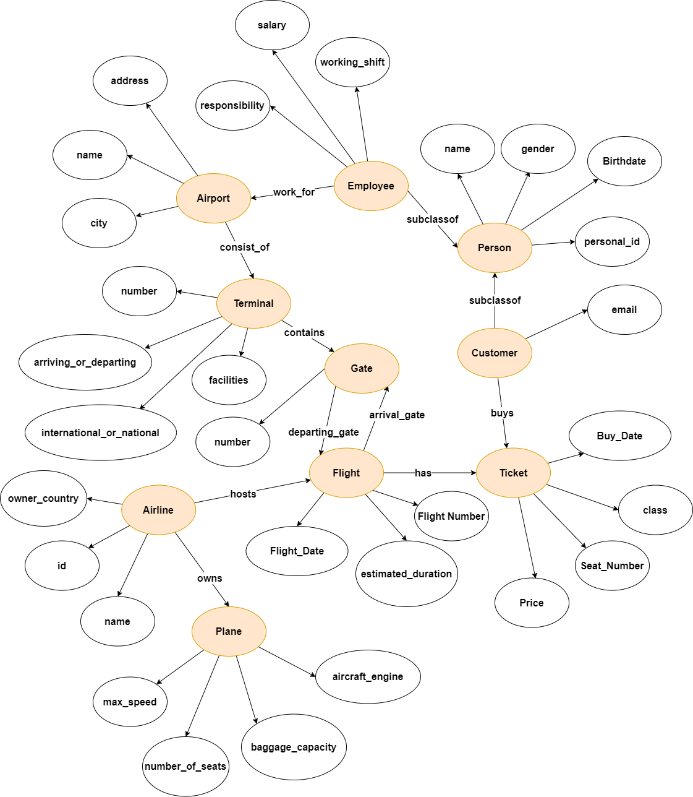

[link_dona]: <https://github.com/dona-samir>
[link_steven]: <https://github.com/steeevvv>

# AIRPORT ONTOLOGY DESIGN
### _CSE488 Ontologies and the Semantic Web Project_

## Introduction
This is a case study for an Airport Ontology design. Where Customers buy tickets, Employees work for airports, Airlines has planes, and much more relations. Throughout this readme we will declare the design of our Ontology: Entities, Object Properties, Data Properties, and Constraints.

It was implemented on Protégé, A free, open-source ontology editor and framework for building intelligent systems.

## RDF Graph

## Declaring Entity Constraints
* Airline
  * An Airline hosts at least 1 Flight
  * An Airline owns Minimum 1 Plane and Maximum 100 Planes
* Airport 
  * An Airport consists of Maximum 5 Terminals
  * An Airport can have Maximum 300 Employee working in 
* Flight 
  * A Flight has exactly 1 Arrival Gate
  * A Flight has exactly 1 Departing Gate
  * A Flight can have a Maximum of 240 Tickets
  * A Flight is hosted by exactly 1 Airline 
* Gate 
  * A Gate has minimum 5 arriving flights
  * A Gate has Minimum 5 departing flights
* Customer (Subclass of Person)
  * A Customer buys at least a ticker
* Employee (Subclass of Person)
  * An Employee works for exactly 1 Airport
* Plane
  * A Plane is owned by exactly 1 Airline
* Terminal
  * A Terminal exists in exactly 1 airport
  * A Terminal contains maximum 52 Gates
* Ticket
  * A Ticket is being bought by exactly 1 Customer
  * A Ticket has exatly 1 Flight     
## Contributers
* Steven Sameh [(github link)][link_steven]
* Dona Samir [(github link)][link_dona]

